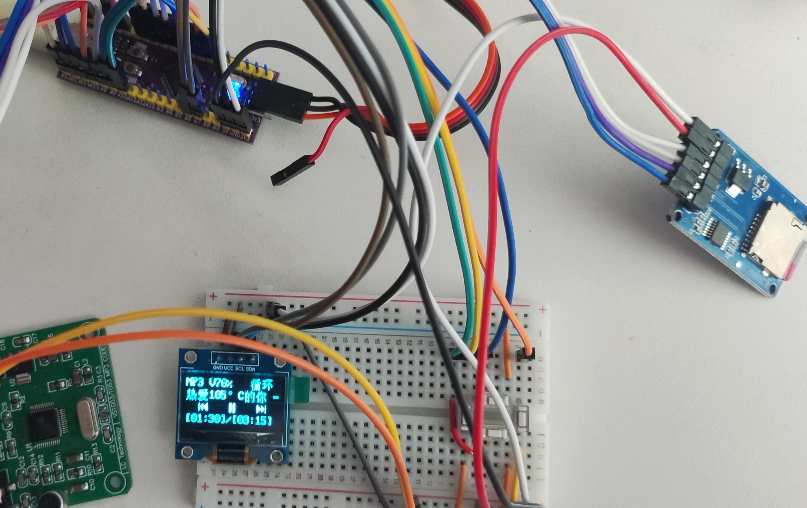
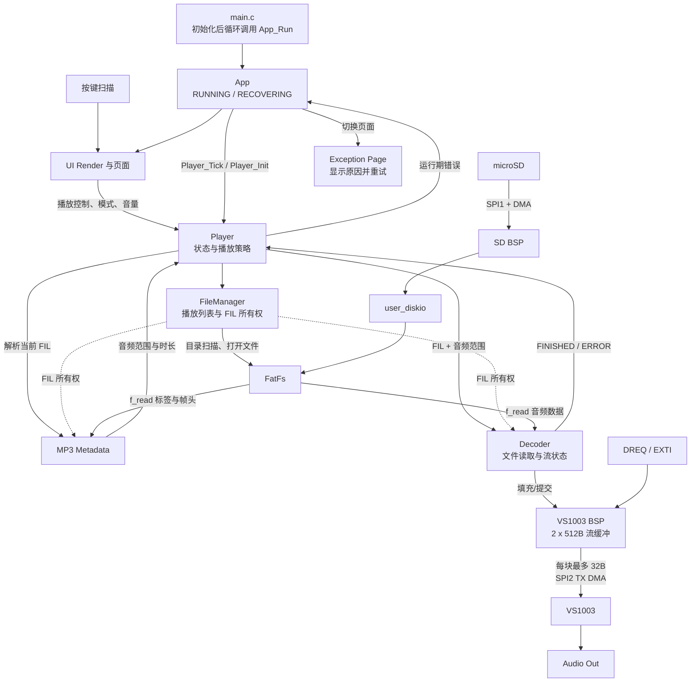

# MiniAudioPlayerST

基于 STM32F072C8T6 的 MP3 音频播放器，SD 卡存储 + VS1003 解码 + OLED 显示。

## 硬件平台

| 模块 | 型号 | 接口 |
|------|------|------|
| MCU | STM32F072C8T6 (Cortex-M0, 48MHz, 64KB Flash, 16KB RAM) | - |
| 音频解码 | VS1003 | SPI2 |
| 存储 | microSD (SPI 模式, FAT32) | SPI1 |
| 显示 | SSD1315 OLED (128x64) | I2C1 |
| 按键 | 4 键 (Menu/OK/L/R) | GPIO |
| 调试串口 | USART2 (PA2-TX / PA3-RX), 115200-8N1 | 外接 USB 转串口模块 |

> **引脚预留**: PA2 和 PA3 由 CubeMX 配置的 USART2 调试串口占用，请勿分配给其他外设。

## 运行演示


## 功能与进度

| 阶段 | 目标 | 状态 |
|------|------|------|
| 1. 硬件驱动验证 | OLED 点亮、SD 卡读写、VS1003 发单音 | OK |
| 2. 基础播放链路 | SD 卡 -> FatFS -> VS1003 播放 MP3 | OK |
| 3. UI 框架 | 屏幕布局渲染 + 按键响应 | OK |
| 4. 完整功能集成 | 播放控制 + 菜单 + 模式切换 | OK |
| 5. 异常处理与打磨 | 异常页面 + 运行期监测 + 自动恢复 | OK |

### 功能清单

已实现：

- 播放/暂停、上一曲/下一曲、音量调节
- 两种播放模式：列表循环、单曲循环
- MP3 元数据、播放时长和进度显示
- 无卡、无文件、文件打开/读取和解码器错误提示
- 运行期错误监测和异常页面切换
- 播放过程中拔出 SD 卡后进入异常页并周期重试，重新插卡后自动恢复到主界面

后续优化：

- 绘制硬件 PCB，改善杜邦线连接下的 SPI 信号质量
- 按键长按和更多 UI 交互细节

## 按键操作

| 页面 | MENU | OK | L | R |
|------|------|----|---|---|
| 主界面 | 进入菜单 | 播放/暂停 | 上一曲 | 下一曲 |
| 菜单 | 返回主界面 | 进入选中项 | 上移 | 下移 |
| 音量调节 | 返回菜单 | — | 音量 -10% | 音量 +10% |
| 播放模式 | 返回菜单，不保存修改 | 保存并返回菜单 | 切换模式 | 切换模式 |
| 文件列表 | 返回菜单 | — | 上移 | 下移 |

按键功能在释放时触发；主界面图标在按下期间放大。当前不支持长按操作。

## SD 卡

- 使用 `FAT32` 文件系统，音乐存放在 `/music` 目录。
- 当前仅支持 MP3。
- 支持 Unicode 长文件名；中文显示前需按歌曲目录生成字库。

## 目录结构

```
.
├── cmake/                         # ARM 链接脚本、OpenOCD 和 clang-format 脚本
├── docs/                          # 需求、设计、构建、测试和模块文档
└── firmware/MiniAudioPlayerST/
    ├── Core/                      # CubeMX 生成的启动、外设初始化和中断入口
    ├── App/
    │   ├── include/               # 应用层公开接口
    │   ├── src/                   # 播放器、文件、解码、UI 和字库实现
    │   └── test/                  # 运行在目标板上的模块与集成测试
    ├── BSP/                       # SD、VS1003、OLED、按键、UART 和 SPI 板级驱动
    ├── FATFS/                     # FatFs 工程配置和 USER 磁盘适配层
    ├── Middlewares/Third_Party/   # FatFs 第三方源码
    ├── Drivers/                   # STM32 HAL、CMSIS 和设备头文件
    └── MDK-ARM/                   # Keil 工程文件
```

### 主要模块

| 模块 | 功能 |
|------|------|
| `Core/Src/main.c` | 初始化 HAL、外设和 FatFs，调用 `App_Init()`，并在主循环中持续调用 `App_Run()`。 |
| `App/src/app.c` | 应用生命周期状态机；协调 Player 与 UI，在 `RUNNING` 和 `RECOVERING` 间切换并周期重试初始化。 |
| `App/src/player.c` | 播放策略层；维护播放状态、音量和播放模式，处理播放控制、自动切歌和错误映射。 |
| `App/src/decoder.c` | 音频流协调层；接收 FileManager 持有的 `FIL *`，读取音频区间、提交流缓冲并报告完成或错误事件。 |
| `App/src/file_manager.c` | 文件所有权与播放列表管理；扫描 `/music`、维护选择位置，并统一打开、持有和关闭当前 `FIL`。 |
| `App/src/sd_card.c` | FatFs 文件系统服务；挂载 SD 卡、遍历音乐目录并生成曲目路径。 |
| `App/src/mp3_metadata.c` | 解析 ID3 标签、首个有效 MP3 帧、音频数据范围、码率和播放时长。 |
| `App/src/ui_render.c` | 页面管理与事件分发；负责页面切换、周期刷新和按键释放事件派发。 |
| `App/src/ui_main_page.c` | 显示曲名、进度、播放状态和模式，并处理播放/暂停、上一曲和下一曲。 |
| `App/src/ui_menu_pages.c` | 实现菜单、音量设置和播放模式设置页面。 |
| `App/src/ui_file_page.c` | 显示文件列表并操作 FileManager 的当前选择。 |
| `App/src/ui_exception_page.c` | 显示初始化或运行期错误及自动重试状态。 |
| `App/src/font_*.c` | 提供中文、英文、文件名和图标点阵字库。 |
| `BSP/src/bsp_SD.c` | 实现 SPI 模式 SD 卡初始化、扇区读写、DMA 接收和卡信息读取。 |
| `FATFS/App/fatfs.c` | 注册 USER 磁盘驱动并建立 FatFs 逻辑盘。 |
| `FATFS/Target/user_diskio.c` | 将 FatFs 磁盘接口映射到 SD BSP，并在通信失败后使磁盘状态失效以支持重新初始化。 |
| `BSP/src/bsp_vs1003.c` | 配置 VS1003，管理两个 512 字节流缓冲区，并按 DREQ 以不超过 32 字节的块通过 SPI2 DMA 发送。 |
| `BSP/src/bsp_spi.c` | 封装 SPI 阻塞收发、DMA 收发、停止和分频配置。 |
| `BSP/src/bsp_spi_event.c` | 将 HAL SPI/DMA 回调和 DREQ EXTI 事件分发给 SD 与 VS1003 驱动。 |
| `BSP/src/bsp_ssd1315.c` | 实现 OLED 初始化、清屏、字符串/图标绘制和显存刷新。 |
| `BSP/src/bsp_key.c` | 实现四按键的周期扫描、消抖和按下/释放事件。 |
| `BSP/src/bsp_uart.c` | 提供调试 UART 输出和日志所需的底层发送能力。 |
| `BSP/src/bsp_i2c_scanner.c` | 扫描 I2C 总线设备，用于硬件诊断。 |

## 数据流




## 存在的缺陷

### 杜邦线连接导致的SPI信号抖动
- 抖动会导致Position获取的值不稳定

应进一步绘制硬件PCB，当前模块化平台已完成技术验证，确定方案可行

## 快速开始

构建、烧录和开发环境配置见[构建文档](./docs/Build.md)。

## 文档

- [产品需求文档 (PRD)](docs/PRD.md)
- [开发文档](docs/Dev.md)
- [构建说明](docs/Build.md)
- [测试说明](docs/Testing.md)
- [决策说明](./docs/Decision.md)
- [字库生成工具](docs/SSD1315/FontTool.md)


## 参考资源

- [STM32F072C8T6 数据手册](https://www.st.com/resource/en/datasheet/stm32f072c8.pdf)
- [VS1003 数据手册](https://www.vlsi.fi/fileadmin/datasheets/vs1003.pdf)
- [FatFS](http://elm-chan.org/fsw/ff/)
