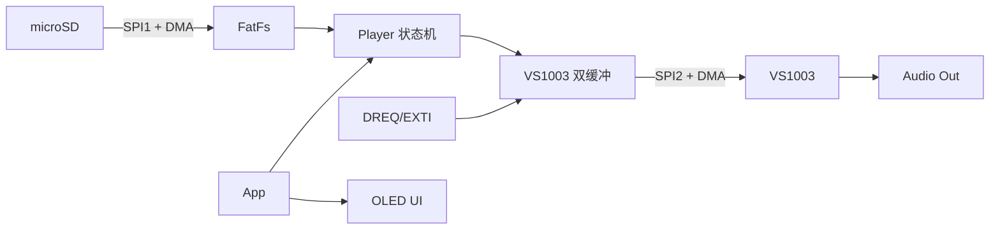

# MiniAudioPlayerST

基于 STM32F072C8T6 的 MP3 音频播放器，SD 卡存储 + VS1003 解码 + OLED 显示。

## 硬件平台

| 模块 | 型号 | 接口 |
|------|------|------|
| MCU | STM32F072C8T6 (Cortex-M0, 48MHz, 64KB Flash, 16KB RAM) | - |
| 音频解码 | VS1003 | SPI2 |
| 存储 | microSD (SPI 模式, FAT32) | SPI1 |
| 显示 | SSD1315 OLED (128x64) | I2C1 |
| 按键 | 4 键 (Menu/OK/L/R) | GPIO |
| 调试串口 | USART2 (PA2-TX / PA3-RX), 115200-8N1 | 外接 USB 转串口模块 |

> **引脚预留**: PA2 和 PA3 由 CubeMX 配置的 USART2 调试串口占用，请勿分配给其他外设。

## 运行演示


## 功能与进度

| 阶段 | 目标 | 状态 |
|------|------|------|
| 1. 硬件驱动验证 | OLED 点亮、SD 卡读写、VS1003 发单音 | OK |
| 2. 基础播放链路 | SD 卡 -> FatFS -> VS1003 播放 MP3 | OK |
| 3. UI 框架 | 屏幕布局渲染 + 按键响应 | OK |
| 4. 完整功能集成 | 播放控制 + 菜单 + 模式切换 | OK |
| 5. 异常处理与打磨 | 所有异常路径 + 体验优化 | 开发中 |

### 功能清单

已实现：

- 播放/暂停、上一曲/下一曲、音量调节
- 两种播放模式：列表循环、单曲循环

待完成：

- SD 卡热插拔检测
- 异常处理：无卡、无文件、解码器错误等

## 按键操作

| 页面 | MENU | OK | L | R |
|------|------|----|---|---|
| 主界面 | 进入菜单 | 播放/暂停 | 上一曲 | 下一曲 |
| 菜单 | 返回主界面 | 进入选中项 | 上移 | 下移 |
| 音量调节 | 返回菜单 | — | 音量 -10% | 音量 +10% |
| 播放模式 | 返回菜单，不保存修改 | 保存并返回菜单 | 切换模式 | 切换模式 |
| 文件列表 | 返回菜单 | — | 上移 | 下移 |

按键功能在释放时触发；主界面图标在按下期间放大。当前不支持长按操作。

## SD 卡

- 使用 `FAT32` 文件系统，音乐存放在 `/music` 目录。
- 当前仅支持 MP3。
- 支持 Unicode 长文件名；中文显示前需按歌曲目录生成字库。

## 目录结构

```
firmware/
└── MiniAudioPlayerST/   # STM32CubeMX 生成的 MDK-ARM 工程
    ├── Core/             # CubeMX 生成代码
    ├── BSP/              # SD、VS1003、OLED、按键等驱动
    ├── App/              # Player、UI、文件管理和应用入口
    ├── Drivers/          # HAL + CMSIS
    └── MDK-ARM/          # Keil 工程
```

## 数据流




## 存在的缺陷

### 杜邦线连接导致的SPI信号抖动
- 抖动会导致Position获取的值不稳定

应进一步绘制硬件PCB，当前模块化平台已完成技术验证，确定方案可行

## 快速开始

构建、烧录和开发环境配置见[构建文档](./docs/Build.md)。

## 文档

- [产品需求文档 (PRD)](docs/PRD.md)
- [开发文档](docs/Dev.md)
- [构建说明](docs/Build.md)
- [测试说明](docs/Testing.md)
- [决策说明](./docs/Decision.md)
- [字库生成工具](docs/SSD1315/FontTool.md)


## 参考资源

- [STM32F072C8T6 数据手册](https://www.st.com/resource/en/datasheet/stm32f072c8.pdf)
- [VS1003 数据手册](https://www.vlsi.fi/fileadmin/datasheets/vs1003.pdf)
- [FatFS](http://elm-chan.org/fsw/ff/)
