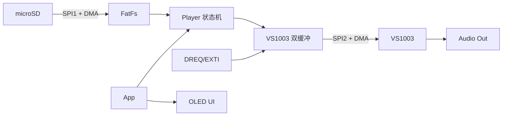

# MiniAudioPlayerST

基于 STM32F072C8T6 的 MP3 音频播放器，SD 卡存储 + VS1003 解码 + OLED 显示。

## 硬件平台

| 模块 | 型号 | 接口 |
|------|------|------|
| MCU | STM32F072C8T6 (Cortex-M0, 48MHz, 64KB Flash, 16KB RAM) | - |
| 音频解码 | VS1003 | SPI2 |
| 存储 | microSD (SPI 模式, FAT32) | SPI1 |
| 显示 | SSD1315 OLED (128x64) | I2C1 |
| 按键 | 4 键 (Menu/OK/L/R) | GPIO |
| 调试串口 | USART2 (PA2-TX / PA3-RX), 115200-8N1 | 外接 USB 转串口模块 |

> **引脚预留**: PA2 和 PA3 由 CubeMX 配置的 USART2 调试串口占用，请勿分配给其他外设。

## 功能与进度

| 阶段 | 目标 | 状态 |
|------|------|------|
| 1. 硬件驱动验证 | OLED 点亮、SD 卡读写、VS1003 发单音 | OK |
| 2. 基础播放链路 | SD 卡 -> FatFS -> VS1003 播放 MP3 | OK |
| 3. UI 框架 | 屏幕布局渲染 + 按键响应 | OK |
| 4. 完整功能集成 | 播放控制 + 菜单 + 模式切换 | OK |
| 5. 异常处理与打磨 | 所有异常路径 + 体验优化 | 开发中 |

### 功能清单

已实现：

- 播放/暂停、上一曲/下一曲、音量调节
- 两种播放模式：列表循环、单曲循环

待完成：

- SD 卡热插拔检测
- 异常处理：无卡、无文件、解码器错误等

## 按键操作

| 页面 | MENU | OK | L | R |
|------|------|----|---|---|
| 主界面 | 进入菜单 | 播放/暂停 | 上一曲 | 下一曲 |
| 菜单 | 返回主界面 | 进入选中项 | 上移 | 下移 |
| 音量调节 | 返回菜单 | — | 音量 -10% | 音量 +10% |
| 播放模式 | 返回菜单，不保存修改 | 保存并返回菜单 | 切换模式 | 切换模式 |
| 文件列表 | 返回菜单 | — | 上移 | 下移 |

按键功能在释放时触发；主界面图标在按下期间放大。当前不支持长按操作。

## SD 卡

- 使用 `FAT32` 文件系统，音乐存放在 `/music` 目录。
- 当前仅支持 MP3。
- 支持 Unicode 长文件名；中文显示前需按歌曲目录生成字库。

## 目录结构

```
firmware/
└── MiniAudioPlayerST/   # STM32CubeMX 生成的 MDK-ARM 工程
    ├── Core/             # CubeMX 生成代码
    ├── BSP/              # SD、VS1003、OLED、按键等驱动
    ├── App/              # Player、UI、文件管理和应用入口
    ├── Drivers/          # HAL + CMSIS
    └── MDK-ARM/          # Keil 工程
```

## 数据流



## 重要决策说明

### 为什么选择 VS1003 硬件解码

- STM32F072 只有 64KB Flash 和 16KB RAM，不适合同时承担 MP3 解码、文件系统和 UI。
- VS1003 负责音频解码，MCU 只处理数据调度和交互。
- 代价是需要管理 SCI/SDI、DREQ 和 SPI 流控。

### 为什么使用定时器驱动按键扫描

- 主循环负载会随播放和 UI 刷新变化，直接轮询 GPIO 难以保证稳定的消抖周期，每次循环执行的时间是不一定相同。
- TIM1 每 10ms 触发一次扫描，使采样和消抖行为不受主循环执行时间影响。
- 中断只更新按键状态和释放沿事件，主循环负责消费事件并执行 UI 操作。
- 代价是中断与主循环共享状态时需要保证原子访问，并控制中断处理时间。

### 为什么 VS1003 使用 DREQ + DMA 双缓冲

- 阻塞发送原型在开启 UART 日志时出现卡顿，说明播放链路缺少调度余量。
- DREQ 表示 VS1003 可接收数据；双缓冲允许 Player 填充一块时由 DMA 发送另一块。
- 代价是需要处理缓冲区状态、DMA 回调和 DREQ 边沿等异步边界。

### 为什么 SD Payload 使用 DMA，但协议控制仍阻塞

- 512 字节 Payload 是主要数据量，适合 DMA。
- CMD、响应、token 都很短，使用阻塞 SPI 更简单可靠。
- 混合方案减少了 CPU 搬运，又避免将整个 SD 状态机异步化。

### 为什么 OLED 使用局部刷新

- 全屏 I2C 刷新会造成闪烁，并与音频数据调度竞争。
- dirty-page/区域刷新只发送变化内容，降低刷新开销。
- 代价是 UI 需要维护显存缓存和变化区域。

### 为什么自建裁剪字库工具

- 示例驱动采用软件 I2C，无法满足本项目的硬件 I2C 和 Unicode 设计。
- 完整中文字库超出 Flash 预算，因此分别从 UI 文案和歌曲文件名中提取必要字符。
- FatFs 使用 Unicode LFN，字库也按 Unicode 码点索引，避免引入 GBK 转换。
- 借助 LLM 完成 Python 工具的初版，再根据 SSD1315 GRAM 格式和实机显示结果迭代。
- 代价是歌曲集合变化后可能需要重新生成文件名字库。

详见[字库生成工具](./docs/SSD1315/FontTool.md)。

### 为什么同时维护 Keil 和 GCC/CMake

- Keil 提供稳定的下载与调试流程，AC5 生成的固件体积也更小。
- GCC/CMake 提供可复现构建，并为 VS Code/clangd 生成 `compile_commands.json`。
- 代价是增删源文件时需要同步两套工程配置。

### 为什么主动缩减功能范围

在完成 VS1003 BSP 后，项目优先实现端到端的 Player 原型，以尽早验证完整播放链路。因此暂缓了顺序/随机播放、Menu 长按返回和部分非核心交互。

### FreeRTOS 还是裸机

- 初始设计文档规划过 FreeRTOS。
- 当前业务可由主循环、定时器、EXTI 和 DMA 完成，引入 RTOS 会增加 RAM 和同步开销。
- 裸机方案要求主循环任务保持非阻塞，并自行处理异步错误传播。

当前裸机版本已经可用，仍需通过长期运行测试验证稳定性。

## 快速开始

构建、烧录和开发环境配置见[构建文档](./docs/Build.md)。

## 文档

- [产品需求文档 (PRD)](docs/PRD.md)
- [开发文档](docs/Dev.md)
- [构建说明](docs/Build.md)
- [测试说明](docs/Testing.md)
- [字库生成工具](docs/SSD1315/FontTool.md)

## 参考资源

- [STM32F072C8T6 数据手册](https://www.st.com/resource/en/datasheet/stm32f072c8.pdf)
- [VS1003 数据手册](https://www.vlsi.fi/fileadmin/datasheets/vs1003.pdf)
- [FatFS](http://elm-chan.org/fsw/ff/)
