# STM32F072C8T6 音频播放器 — 开发文档

---

## 目录

1. [STM32CubeMX 工程生成与配置](#1-stm32cubemx-工程生成与配置)
2. [功能开发步骤](#2-功能开发步骤)
3. [工程化注意事项](#3-工程化注意事项)
4. [附录](#4-附录)

---

## 1. STM32CubeMX 工程生成与配置

### 1.1 创建新工程

| 步骤 | 操作 | 说明 |
|------|------|------|
| 1 | 打开 STM32CubeMX，点击 **New Project** → **Access to MCU Selector** | |
| 2 | 在 Commercial Part Number 中输入 `STM32F072C8Tx`，双击搜索结果 | 选用 LQFP48 封装 |
| 3 | 保存工程：`File → Save Project As...` → 命名为 `MiniAudioPlayerST.ioc`，路径选择 `firmware/` | 路径不要含中文或空格 |

### 1.2 Pinout 配置（Pinout & Configuration 页面）

#### 1.2.1 系统核心

| 配置项 | 标签页 | 参数 | 值 |
|--------|--------|------|-----|
| SYS | Debug | Serial Wire | **Serial Wire**（必须开启，否则无法二次烧录） |
| RCC | High Speed Clock (HSE) | **Crystal/Ceramic Resonator** | 外部 8MHz 无源晶振（常见两脚石英晶振 + 负载电容），启用 PF0/OSC_IN、PF1/OSC_OUT |
| RCC | Low Speed Clock (LSE) | | Disable（本工程无需 RTC） |

> ⚠️ **Crystal vs Bypass 区别**：
> - **Crystal/Ceramic Resonator**：无源晶振（两脚 8MHz 石英晶振 + 两个负载电容），OSC_IN 和 OSC_OUT 各接晶振一脚，利用 MCU 内部 Pierce 振荡电路起振。适合绝大多数 DIY/开发板。
> - **Bypass Clock Source**：有源晶振（外部时钟模块输出方波信号），仅接 OSC_IN，OSC_OUT 悬空，内部振荡电路被旁路。适合需要高精度时钟的场景。

#### 1.2.2 GPIO 输入 — 按键

| 标签名 | 引脚 | 模式 | GPIO 配置 |
|--------|------|------|-----------|
| KEY_MENU | **PA9**  | GPIO_Input | Pull-up |
| KEY_OK   | **PA10**  | GPIO_Input | Pull-up |
| KEY_L    | **PA11** | GPIO_Input | Pull-up |
| KEY_R    | **PA12** | GPIO_Input | Pull-up |

> **按键方案说明**：PRD 要求硬件消抖（由板级 RC 电路实现），默认上拉，按下接 GND。软件侧由 FreeRTOS 按键扫描任务 20ms 轮询去抖，不依赖外部中断。

#### 1.2.3 SPI1 — SD 卡

```mermaid
graph TB
    %% ═══════════════════════════════════════════════════════════
    %% 硬件层
    %% ═══════════════════════════════════════════════════════════
    subgraph HW[" 硬件层 Hardware "]
        SD[("microSD 卡<br/>FAT32 / SPI 模式<br/>──────────────<br/>物理扇区: 512B")]
        VS1003["VS1003 解码芯片<br/>MP3/WAV 硬件解码<br/>──────────────<br/>18-bit sigma-delta DAC"]
        OUT[("音频输出<br/>3.5mm AUX<br/>──────────────<br/>模拟音频信号")]
    end

    %% ═══════════════════════════════════════════════════════════
    %% MCU 外设层
    %% ═══════════════════════════════════════════════════════════
    subgraph PERIPH[" MCU 外设层 Peripheral "]
        SPI1["SPI1 外设<br/>──────────────<br/>PA5 SCK / PA6 MISO<br/>PA7 MOSI / PA4 CS<br/>Full-Duplex Master<br/>初始化 375kbps<br/>运行 ~12Mbps"]
        SPI2["SPI2 外设<br/>──────────────<br/>PB13 SCK / PB14 MISO<br/>PB15 MOSI<br/>XCS: PB11 / XDCS: PB12<br/>Full-Duplex Master<br/>运行 ≤6Mbps"]
        DMA_CH2["DMA1 Channel 2<br/>──────────────<br/>Memory → SPI2_TX<br/>Normal 模式 (非 Circular)<br/>Byte × Byte<br/>每次传输: 32 字节"]
        EXTI10["EXTI10 中断线<br/>──────────────<br/>DREQ: PB10<br/>上升沿触发<br/>抢占优先级: 0 (最高)"]
    end

    %% ═══════════════════════════════════════════════════════════
    %% BSP 驱动层
    %% ═══════════════════════════════════════════════════════════
    subgraph BSP[" BSP 驱动层 Board Support Package "]
        BSP_SPI["bsp_spi.c<br/>──────────────<br/>SPI 硬件抽象接口<br/>BSP_SPI_TransmitReceive8()<br/>BSP_SPI_TransmitReceive()<br/>BSP_SPI_Transmit()<br/>BSP_SPI_Receive()<br/>BSP_SPI_SetSpeed()"]
        BSP_SD["bsp_SD.c<br/>──────────────<br/>SD 卡协议驱动<br/>BSP_SD_CardInit()　　CMD0/CMD8/ACMD41<br/>BSP_SD_ReadBlocks()　 CMD17 单块读<br/>BSP_SD_WriteBlocks()　CMD24 单块写<br/>BSP_SD_GetInfo()<br/>BSP_SD_GetState()"]
    end

    %% ═══════════════════════════════════════════════════════════
    %% 中间件层
    %% ═══════════════════════════════════════════════════════════
    subgraph MIDDLEWARE[" 中间件层 Middleware "]
        DISKIO["user_diskio.c<br/>──────────────<br/>FatFS 磁盘 I/O 适配层<br/>disk_initialize()<br/>disk_read()<br/>disk_write()<br/>disk_ioctl()<br/>disk_status()"]
        FATFS["FatFS (ff.c)<br/>──────────────<br/>文件系统核心<br/>f_mount()<br/>f_open()<br/>f_read()<br/>f_lseek()<br/>f_opendir() / f_readdir()<br/>f_close()"]
    end

    %% ═══════════════════════════════════════════════════════════
    %% 应用层
    %% ═══════════════════════════════════════════════════════════
    subgraph APP[" 应用层 Application (FreeRTOS Tasks) "]
        MAIN["mainTask<br/>──────────────<br/>主状态机<br/>播放控制 / 切歌逻辑<br/>优先级: Normal"]
        AUDIO["audioTask<br/>──────────────<br/>优先级: High (最高)<br/>等待 DREQ 信号量<br/>SD 卡读取数据<br/>填充双缓冲<br/>启动 DMA"]
        FILE_BUF[("文件读取缓冲区<br/>──────────────<br/>uint8_t buf[N]<br/>f_read() 可变大小填充")]
        PCM_PP[("PCM 双缓冲 Ping-Pong<br/>──────────────<br/>buf_A[32] / buf_B[32]<br/>填一块 → 发一块<br/>DREQ 触发 32B/次")]
    end

    %% ============================================================
    %% 数据流连线 (实线 = 数据路径)
    %% ============================================================

    %% ── 链路 A: SD 卡 → 文件系统 → 应用 (文件读取) ──
    SD      -->|"CMD17 读扇区<br/>数据令牌 + 512B 块 + CRC16"| SPI1
    SPI1    -->|"SPI 全双工 8-bit 帧<br/>TX dummy 0xFF → RX 数据"| BSP_SPI
    BSP_SPI -->|"uint8_t 单字节/多字节<br/>收发原语 (阻塞)"| BSP_SD
    BSP_SD  -->|"扇区缓冲区<br/>uint8_t buf[512]<br/>DSTATUS / DRESULT"| DISKIO
    DISKIO  -->|"512B 磁盘扇区<br/>LBA 逻辑块寻址"| FATFS
    FATFS   -->|"文件字节流<br/>UINT bytes_read<br/>可变大小 (如 512~4096B)"| FILE_BUF
    FILE_BUF-->|"MP3/WAV 原始数据<br/>应用层数据块"| AUDIO

    %% ── 链路 B: 双缓冲 → DMA → VS1003 → 音频 (音频输出) ──
    AUDIO   -->|"切缓冲指针<br/>填 buf_A 时用 buf_B 发送<br/>每次 32 字节"| PCM_PP
    PCM_PP  -->|"设置 DMA 源地址<br/>Memory → Peripheral<br/>32 字节 × 1 次"| DMA_CH2
    DMA_CH2 -->|"逐字节写入 SPI2 TXDR<br/>DMA 完成中断标记<br/>当前缓冲块可用"| SPI2
    SPI2    -->|"XDCS 拉低选通<br/>SPI 模式 0 (CPOL=0 CPHA=0)<br/>8-bit 数据帧"| VS1003
    VS1003  -->|"立体声 DAC 解码<br/>18-bit sigma-delta<br/>模拟音频"| OUT

    %% ============================================================
    %% 控制流连线 (虚线 = 控制/反馈路径)
    %% ============================================================

    %% DREQ 流控反馈回路
    VS1003  -.->|"<b>DREQ 上升沿</b><br/>芯片 FIFO ≥ 32B 空闲<br/>可接收下一帧数据"| EXTI10
    EXTI10  -.->|"xSemaphoreGiveFromISR()<br/>释放计数信号量<br/>唤醒 audioTask"| AUDIO
    MAIN    -.->|"播放/暂停/切歌<br/>状态变更通知"| AUDIO

```



> **数据形态变化说明：**
>
> | 阶段 | 数据形式 | 大小 | 所在模块 |
> |------|---------|------|---------|
> | SD 卡物理存储 | 原始扇区 (含数据令牌 + CRC) | 512B 有效数据 | 硬件 |
> | SPI 总线传输 | 8-bit 帧 (全双工, TX dummy 0xFF) | 单字节流 | SPI1 外设 |
> | BSP SPI 接口 | `uint8_t` 字节收发 | 单字节 / 多字节数组 | `bsp_spi.c` |
> | BSP SD 协议层 | SD 命令/响应 + 扇区数据缓冲 | `uint8_t[512]` | `bsp_SD.c` |
> | FatFS 磁盘 I/O | 逻辑扇区 (LBA 寻址) | 512B/扇区 | `user_diskio.c` |
> | FatFS 文件 API | 文件字节流 | 可变大小 (`UINT`) | `ff.c` |
> | 应用文件缓冲 | 原始 MP3/WAV 字节 | 可变大小 (`f_read` 指定) | `audioTask` |
> | PCM 双缓冲 | 待发送音频帧 | **32 字节** × 2 (Ping-Pong) | `audioTask` |
> | DMA 传输 | Memory → Peripheral 逐字节搬运 | 32 字节/次 (Normal 模式) | DMA1 CH2 |
> | SPI2 → VS1003 | SPI 数据帧 (XDCS 选通) | 32 字节/帧 | SPI2 外设 |
> | VS1003 输出 | 解码后的模拟音频 | 连续信号 | VS1003 DAC |

> **模块分工与职责边界：**
>
> | 模块 | 文件 | 职责 |
> |------|------|------|
> | SPI 硬件抽象 | `bsp_spi.c/h` | 封装 HAL SPI 操作，提供 `TransmitReceive8/TransmitReceive/Transmit/Receive/SetSpeed` 五个原语。不管理 CS 引脚，不关心上层协议。 |
> | SD 卡协议驱动 | `bsp_SD.c/h` | 管理 CS 引脚，实现 SD 卡 SPI 模式协议：上电低速初始化 (CMD0/CMD8/ACMD41/CMD58)、扇区读写 (CMD17/CMD24)、卡状态与信息查询。向上提供 `ReadBlocks/WriteBlocks` 扇区级接口。 |
> | FatFS 适配层 | `user_diskio.c` | 将 FatFS 的 `disk_read/disk_write/disk_ioctl` 等标准接口映射到 `BSP_SD_ReadBlocks/BSP_SD_WriteBlocks`。处理扇区地址转换、返回值适配。 |
> | FatFS 文件系统 | `ff.c` | 实现 FAT32 文件系统逻辑：目录遍历、文件打开/关闭、流式读取 (`f_read`)、文件定位 (`f_lseek`)、长文件名 (LFN UTF-16LE) 支持。 |
> | 应用层音频管理 | `audioTask` | DREQ 信号量驱动的音频数据泵：等待 DREQ → 从文件读数据到文件缓冲 → 切分 32B 块填双缓冲 → 启动 DMA 发送。 |
> | DMA + SPI2 发送 | DMA1 CH2 / SPI2 | 硬件自动将双缓冲中的 32 字节逐字节搬到 SPI2 TX 寄存器，发送给 VS1003。Normal 模式，每次由软件手动启动。 |

| 标签名 | 引脚 | 模式 |
|--------|------|------|
| SPI1_SCK  | **PA5** | Alternate Function Push-Pull |
| SPI1_MISO | **PA6** | Alternate Function Push-Pull |
| SPI1_MOSI | **PA7** | Alternate Function Push-Pull |
| SPI1_CS   | **PA4** | GPIO_Output（软件控制 CS） |

**SPI1 参数配置：**

| 参数 | 值 | 说明 |
|------|-----|------|
| Mode | Full-Duplex Master | |
| Hardware NSS | **Disable** | 软件控制 CS |
| Frame Format | Motorola | |
| Data Size | 8 Bits | |
| Prescaler | **128 (375 Kbps)** | 初始化低速 < 400kHz，初始化完成后动态切高速 |
| CPOL | Low | |
| CPHA | 1 Edge | |
| CRC Calculation | Disable | |

> **注意**：SD 卡 SPI 初始化阶段必须低速（< 400kHz），初始化成功后可在代码中动态调整预分频至 4 或 2（最高 ~12Mbps）。Cortex-M0 的 SPI1 挂在 APB2（配合 F072 实际总线是 APB1@48MHz 仍有余量），最大时钟 24MHz。
>
> **重要 — SPI 时钟生成机制与 SD 卡总线释放**：
>
> STM32 SPI 主机在 **MOSI 发送数据时才会在 SCK 上产生时钟脉冲**。如果没有 MOSI 输出（即不向 SPI_DR 写数据），SCK 保持空闲电平，SPI 总线不会有时钟活动。
>
> 这意味着：**每次通过 CS 拉低选中 SD 卡、发送完命令或数据后，即使 CS 已经拉高，也必须额外发送至少 1 个 dummy 字节（通常为 `0xFF`）来产生 8 个 SCK 时钟周期**。原因是：
>
> 1. SD 卡内部状态机需要额外时钟周期完成当前 SPI 事务的收尾（如 CRC 校验、状态寄存器更新）。
> 2. 如果不发 dummy 字节就立即拉高 CS，SD 卡可能卡在未完成的 SPI 状态中，导致下次 CS 拉低时通信异常。
> 3. 在 SPI 全双工模式下，发 `0xFF` 的同时 MISO 会读出数据（可忽略），这是一种安全的 "空操作时钟"。
>
> **典型代码模式**：
>
> ```c
> /* 发送 CMD17 后释放总线 */
> BSP_SD_ChipSelect(1);               // CS = HIGH，撤销片选
> BSP_SPI_TransmitReceive8(&hspi1, 0xFF); // 发 dummy 字节，产生 8 个 SCK
>                                         // 让 SD 卡完成总线释放，进入空闲
> ```
>
> 该 dummy 字节应出现在以下场景：
> - 每条 SD 命令 (CMD) 发送完毕、CS 拉高之后。
> - 数据块读写完成、CS 拉高之后。
> - CS 拉低（重新选中 SD 卡）之后、发送第一条命令之前（可选，但推荐，用于清空 SD 卡残留状态）。

#### 1.2.4 SPI2 — VS1003 音频解码模块

| 标签名 | 引脚 | 模式 |
|--------|------|------|
| SPI2_SCK  | **PB13** | Alternate Function Push-Pull |
| SPI2_MISO | **PB14** | Alternate Function Push-Pull |
| SPI2_MOSI | **PB15** | Alternate Function Push-Pull |
| XCS       | **PB11** | GPIO_Output（命令片选） |
| XDCS      | **PB12** | GPIO_Output（数据片选） |
| DREQ      | **PB10** | GPIO_Input，上拉，外部中断 **上升沿触发** |

**SPI2 参数配置：**

| 参数 | 值 | 说明 |
|------|-----|------|
| Mode | Full-Duplex Master | |
| Hardware NSS | Disable | 两个软件 CS（XCS / XDCS），软件中分别控制 |
| Frame Format | Motorola | |
| Data Size | 8 Bits | |
| Prescaler | **64 (750 Kbps)** | 初始化 1MHz 以下，运行中可动态切换到 ~6MHz |
| CPOL | Low | VS1003 要求 SPI 模式 0（CPOL=0, CPHA=0） |
| CPHA | 1 Edge | |
| CRC Calculation | Disable | |

> **重点**：VS1003 有两根片选 — **XCS（命令）** 与 **XDCS（数据）**，务必在软件中分别管理。DREQ 配置为 GPIO 上升沿外部中断，对应 PRD 第 3.2 节中的流控方案。

#### 1.2.5 I2C1 — OLED（MAP2606 / SSD1306）

| 标签名 | 引脚 | 模式 |
|--------|------|------|
| I2C1_SCL | **PB6** | Alternate Function Open-Drain |
| I2C1_SDA | **PB7** | Alternate Function Open-Drain |

**I2C1 参数配置：**

> I2C Mode配置：可选Disable(禁用)、I2C(通用双线模式)或SMBus(带超时机制/硬件报警的系统管理总线模式)。

| 参数 | 值 |
|------|-----|
| I2C Speed Mode | **Fast Mode** |
| Clock Speed | 400 000 Hz |
| I2C Address | `0x3C << 1 = 0x78`（SSD1306 7 位地址 0x3C） |

> **注意**：部分 SSD1306 模块 SA0 引脚拉高时地址为 `0x3D`，需根据实际模块焊盘确认。

### 1.3 Middleware 配置

#### 1.3.1 FreeRTOS

在 **Middleware → FREERTOS** 中选择 **CMSIS_V1**（或 CMSIS_V2，视 CubeMX 版本）：

| 参数 | 值 | 说明 |
|------|-----|------|
| USE_PREEMPTION | Enabled | 抢占式调度 |
| TICK_RATE_HZ | 1000 | 1ms tick |
| MAX_PRIORITIES | 8 | |
| MINIMAL_STACK_SIZE | 128 words | |
| TOTAL_HEAP_SIZE | **4096**（4KB） | PRD RAM 预算中 FreeRTOS 开销对应 4KB |
| USE_MUTEXES | Enabled | FATFS 重入需要 |
| USE_COUNTING_SEMAPHORES | Enabled | DREQ 流控 |
| USE_TASK_NOTIFICATIONS | Enabled | 低开销任务间通信 |

> ⚠️ Cortex-M0 没有 `CLZ` 等指令，FreeRTOS 的 port 层会自动适配。CubeMX 生成后确认 PendSV / SysTick 中断配置正确。

#### 1.3.2 FATFS

在 **Middleware → FATFS** 中选择 **User-defined** 模式：

| 参数 | 值 | 说明 |
|------|-----|------|
| Mode | **User-defined** | 手动适配 SPI SD |
| _VOLUMES | 1 | 仅一个卷（SD 卡） |
| _MAX_SS | 512 | 扇区大小 |
| _MIN_SS | 512 | |
| _USE_LFN | **1（启用 LFN 静态缓冲区）** | 支持长文件名（盘上 LFN 为 UTF-16LE） |
| _MAX_LFN | 64 | 最长文件名（按 PRD 约束） |
| _LFN_UNICODE | **1（UTF-16 API）** | `TCHAR`/`f_readdir` 等路径与文件名为 UTF-16，与字库 Unicode 一致；**不使用 GBK** |
| _CODE_PAGE | **437** | 仅 SFN/OEM 兼容兜底；中文显示与打开文件主路径一律走 LFN Unicode |
| _USE_ERASE | 0 | 不需要 |
| _FS_LOCK | 1 | 文件锁定 |
| _FS_REENTRANT | **1（启用）** | FreeRTOS 下需要重入保护 |
| _FS_TIMEOUT | 1000 | 信号量超时 ms |
| _SYNC_t | osSemaphoreId | FreeRTOS 互斥信号量句柄 |

> CubeMX 生成 `user_diskio.c`，在其中实现 SPI 读写 SD 卡的实际函数：`disk_initialize()`、`disk_read()`、`disk_write()`、`disk_status()`、`disk_ioctl()`。

### 1.4 FreeRTOS 任务

在 **Tasks and Queues** 选项卡中创建以下任务：

| Task Name | Priority (osPriority) | Stack Size (words) | Entry Function | 说明 |
|-----------|----------------------|---------------------|----------------|------|
| audioTask | osPriority**High** | 256 (1024B) | StartAudioTask | DREQ 信号量等待 + SD 读取 + 填充缓冲 + 启动 DMA |
| uiTask    | osPriority**Normal** | 128 (512B) | StartUITask | 仅在状态变化时刷新 OLED |
| keyTask   | osPriority**Normal** | 64 (256B) | StartKeyTask | 20ms 轮询 GPIO，按下沿发事件 |
| mainTask  | osPriority**Normal** | 128 (512B) | StartMainTask | 主状态机，协调各模块 |

> CMSIS V1 中优先级数值 **越大优先级越高**。audioTask 为最高，防止音频 underrun。

### 1.5 DMA 配置

| DMA 通道 | 外设 | 方向 | 模式 | 数据宽度 |
|----------|------|------|------|---------|
| DMA1 Channel 2 | SPI2_TX | Memory to Peripheral | **Normal**（单次，每次手动启动） | Byte × Byte |
| DMA1 Channel 3 | SPI1_RX | Peripheral to Memory | Normal | Byte × Byte |

> **关键**：SPI2 TX 的 DMA 配置为 **Normal 模式**，不是 Circular。每次 DREQ 外部中断触发后，由任务手动启动一次 32 字节 DMA 传输，与 PRD 9.5 节方案一致。

### 1.6 NVIC 中断优先级

Cortex-M0 仅支持 2 位抢占优先级（即 0~3）。STM32F0 默认使用 NVIC_PRIORITYGROUP_2（2 抢占 + 2 子）。

| 中断 | 抢占优先级 | 子优先级 | 说明 |
|------|-----------|---------|------|
| EXTI10 (DREQ) | **0** | 0 | 最高优先级 — 音频流控 |
| DMA1 Channel 2 (SPI2 TX 完成) | 1 | 0 | 音频数据 DMA 完成 |
| SPI1 / SPI2 IRQ | 2 | 0 | SPI 通信中断 |
| EXTI8..11 (按键) | 3 | 0 | 按键中断 |
| I2C1 Event | 4 | 0 | I2C 事件 |
| SysTick | 5 | 0 | FreeRTOS 心跳 |

### 1.7 时钟树配置

```
HSE (外部 8MHz 晶振)
  │
  └── /1 ──→ PLL (×6) ──→ PLLCLK = 48MHz
                              │
                              └── SYSCLK = 48MHz
                                    ├── HCLK = 48MHz (AHB)
                                    ├── APB1 (PCLK1) = 48MHz
                                    │     ├── SPI2
                                    │     ├── I2C1
                                    │     └── TIM2/3 等
                                    └── APB2 (PCLK2) = 48MHz (若有)
```

**配置步骤**：

1. Clock Configuration 页 → HSE 栏输入 **8MHz**
2. PLL Source Mux 选择 **HSE**
3. PREDIV 设为 **/1**，PLLMUL 设为 **×6**（8 × 6 = 48MHz）
4. System Clock Mux 选择 **PLLCLK**
5. 确认 HCLK / APB1 / APB2 均不分频（即 = 48MHz）
6. 点击 **Resolve Clock Issues** 确认无报警

> **说明**：选用外部 8MHz 晶振精度比内部 RC 高，音频场景下更稳定。若板上只有一个 8MHz 无源晶振且未接负载电容，需确认起振正常后再锁定此时钟方案。


---


### 4.3 关键寄存器速查

| 芯片 | 寄存器 | 地址 | 说明 |
|------|--------|------|------|
| VS1003 | SCI_MODE | 0x00 | 模式控制（软件复位 0x0804） |
| VS1003 | SCI_STATUS | 0x01 | 状态 |
| VS1003 | SCI_BASS | 0x02 | 低音增强 |
| VS1003 | SCI_CLOCKF | 0x03 | 时钟频率 + 倍频 |
| VS1003 | SCI_VOL | 0x0B | 音量（左声道:右声道） |
| SSD1306 | DEV_ADDR | 0x3C | I2C 7 位地址 |
| SSD1306 | CMD_DISPLAY_ON | 0xAF | 显示开 |

### 4.4 参考资料

- STM32F072C8T6 数据手册: https://www.st.com/resource/en/datasheet/stm32f072c8.pdf
- VS1003 数据手册: https://www.vlsi.fi/fileadmin/datasheets/vs1003.pdf
- FatFS: http://elm-chan.org/fsw/ff/
- SSD1306 数据手册: https://cdn-shop.adafruit.com/datasheets/SSD1306.pdf
- FreeRTOS 官方文档: https://www.freertos.org/Documentation/
- STM32CubeMX 用户手册: https://www.st.com/resource/en/user_manual/um1718.pdf

### 4.5 版本历史

| 版本 | 日期 | 修改内容 | 作者 |
|------|------|---------|------|
| v0.1 | 2026-07-01 | 初稿（对应 PRD v0.1） | leejkee |
