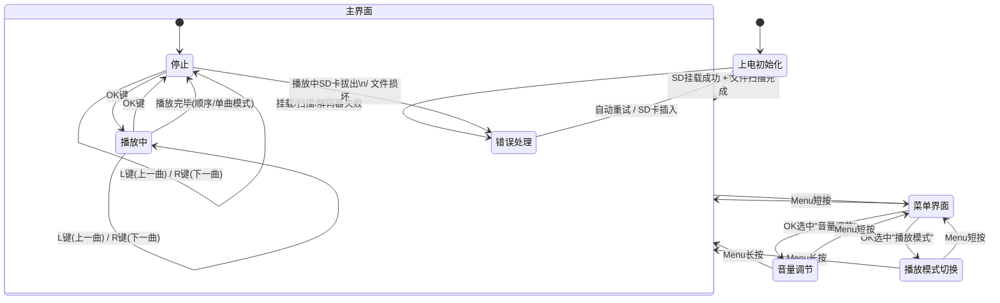
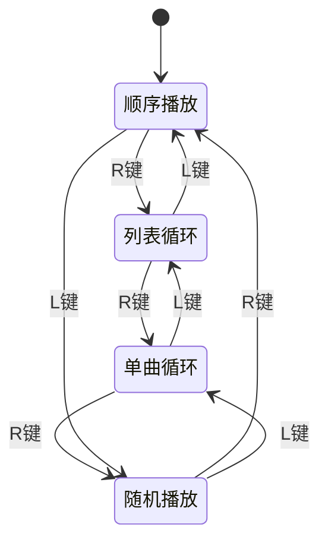

# 产品需求文档

---

## 1. 项目名称

基于 STM32F072C8T6 的音频播放器

---

## 2. 项目概述

本项目实现嵌入式 MCU 控制音频解码芯片，播放来自 SD 卡的音频文件。

### 2.1 目标用户

个人DIY爱好者、工程demo展示

### 2.2 核心使用场景

实验调试固件

### 2.3 产品定位

成品模块组合的Mp3播放器试验项目

### 2.4 目标体验

能够跑通最基本的播放功能，保证开机到播放音乐在10s之内即可，用户只需要接通电源并按一次播放键

---

## 3. 硬件平台与约束

> 嵌入式产品的硬件直接决定功能边界。以下每条都需要确认，因为它会限制或影响后续的功能设计。

### 3.1 主控 MCU

| 项目 | 内容 |
|------|------|
| 型号 | STM32F072C8T6 |
| 内核 | ARM Cortex-M0 |
| 主频 | 48MHz |
| Flash |  64KB |
| RAM | 16KB |
| DMA 通道数 | 1组7个通道 |
| SPI 接口数 | 2组 |
| I2C 接口数 | 2组 |
| GPIO 可用数 | 足够 |

**Flash/RAM 预算估算：**

| 占用项 | 估算大小 | 说明 |
|--------|---------|------|
| 固件代码 | 30KB | 包含驱动+FatFS+应用逻辑 |
| 点阵字体 | 20KB | 提取所需的中文和英文字符点阵数据 |
| 音频数据缓冲区 | 1KB | DMA 双缓冲，典型 512B×2 或更大 |
| 文件信息缓存 | 1.5KB | 按每首文件名 N 字节 × 最大曲目数估算 |
| UI 缓冲区 | 1KB | OLED 显存映射 |
| FatFS 内部缓冲 | 1KB | OLED 显存映射 |
| FreeRTOS开销 | 4KB | 任务栈 + 内核结构 |
| **Flash 总计** | **35KB** | 不可超过芯片规格 |
| **RAM 总计** | **10KB** | 不可超过芯片规格 |

### 3.2 音频解码模块

| 项目 | 内容 |
|------|------|
| 型号 | VS1003 |
| 支持格式 | MP3 |
| 支持的比特率范围 | 32~128kbps MP3 |
| 与 MCU 通信接口 | SPI 从机|
| 数据流控方式 |  DREQ 配置stm32的外部中断 |
| DAC 分辨率 | 18-bit sigma-delta |
| 输出方式 | AUX |
| 音量控制范围 | -127dB ~ 0dB(无衰减) |

### 3.3 显示模块

| 项目 | 内容 |
|------|------|
| 型号 | MAP2606 |
| 分辨率 | 128x64 |
| 颜色 | 白 |
| 接口 | I2C |
| 可显示行数（基于 16px 字体） | 4   |
| 每行最多字符数（基于 8px 字体） | 128÷8=16 |

### 3.4 存储模块

CH376S 模块

| 项目 | 内容 |
|------|------|
| 介质 | microSD 卡（SPI 模式） |
| 文件系统 | FAT32 |
| 支持的 SD 卡容量上限 |  最大 32GB |
| 读取速度 | 2MB/s |

### 3.5 按键

| 项目 | 内容 |
|------|------|
| 按键数量 | 4 |
| 按键布局 | 上面一个，下面三个 |
| 按键类型 | 按下触发 |
| 消抖方案 | 硬件 |

### 3.6 供电

| 项目 | 内容 |
|------|------|
| 供电方式 | USB 5V |
| 稳压方案 | 板载USB电路 |
| 是否需要电量检测 | 否 |
| 目标续航 | - |

---

## 4. 功能清单

### 4.1 音频播放 (主界面)

| 功能 | 说明 |
|------|------|
| 播放/暂停 | 主界面 OK 键切换 |
| 上一曲 | 主界面 L 键 直接切换到列表的上一首歌 |
| 下一曲 | 主界面 R 键 直接切换到列表的下一首歌|
| 音量调节 | R 键 +10%, L 键 -10%, 范围 ：0%~100% |
| 静音 | 音量调到 0% 即为静音 |
| 快进/快退 | 长按 L/R 先不作为必须功能，扩展再做 |

### 4.2 播放模式

需要支持的播放模式：

- 顺序播放（播完最后一首停止）
- 列表循环（播完最后一首回到第一首）
- 单曲循环
- 随机播放

### 4.3 启动行为

| 场景 | 行为 |
|------|------|
| 首次上电（SD 卡有文件） | 停在主界面等待按键 |
| 再次上电（断电前正在播放） | 仍然视为重新启动，不写Flash |
| SD 卡中文件数量 | 懒加载 |

### 4.4 文件格式支持

| 类型 | 说明 |
|------|------|
| 音频格式 | MP3 |
| 采样率/比特率 | 44.1kHz/128kbps |
| 文件命名规范 | 01-歌名.mp3 支持中文文件名 |
| 文件排序规则 | 按 文件名 顺序 |

---

## 5. UI 设计

### 5.1 屏幕布局（主界面）

> 中文使用16x16字库，英文使用8x16字库，也就是一共四行，每行最多8个汉字，16个字符

```
┌──────────────────────────────────┐
│ 第 1 行：Logo 音量 模式(顺序，循环)  │
│ 第 2 行： 歌曲名称（超过8字则滚动处理）│
│ 第 3 行：上一曲，下一曲，播放/暂停 按键│
│ 第 4 行：时长显示                  │
└──────────────────────────────────┘
```

**逐行定义：**

| 行 | 内容 | 格式 | 说明 |
|----|------|------|------|
| 1 | Logo / 项目名 | MAP26 | |
| 1 | 音量 | 格式 "自定义图标: 70%" | |
| 1 | 播放模式 | 显示 "自定义图标" | |
| 2 | 歌曲名 | 01-TrackName.mp3 滚动 | |
| 3 | UI按键 | 自定义图标 |
| 4 | 播放进度 |  "[01:23]/[04:56] | |

### 5.2 屏幕布局（菜单界面）

```
┌─────────────────────┐
│ 第 1 行：Menu 标题    │
│ 第 2 行：> 音量调节   │
│ 第 3 行：  播放模式   │
│ 第 4 行：  文件列表   │
└─────────────────────┘
```

### ~~5.3 进度条设计~~
废弃


### 5.4 字体与显示规格

由于FLASH大小限制，本项目采用固定示例歌曲，也就是只会用到固定字符集合，极大压缩字符占用空间
| 项目 | 说明 |
|------|------|
| 中文字库 | 存到 Flash 中 |
| 字库占用空间 | 16x16 |
| 英文字体大小 | 8×16 |
| 是否使用 OLED 自带硬字库 | 否 |

---

## 6. 按键交互

### 6.1 按键布局

```
    ┌────Menu────┐
    └──────┬─────┘
  ┌───L──┐ │ ┌───OK──┐ ┌───R───┐
  └──────┘   └───────┘ └──────┘
```

### 6.2 主界面按键定义

| Button | Short Press | Long Press | 说明 |
|--------|-------------|------------|------|
| OK | 播放/暂停切换 | 无 | |
| R | 下一曲 | 快进 | |
| L | 上一曲 | 快退 | |
| Menu | 进入菜单 | 长按返回主界面 | |

### 6.3 菜单界面按键定义

| Button | Short Press | 说明 |
|--------|-------------|------|
| OK | 进入当前选中项 | |
| R | 光标下移 / 下一选项 | |
| L | 光标上移 / 上一选项 | |
| Menu | 返回上级 | |

### 6.4 子界面按键定义

#### 音量调节

| Button | Short Press | Long Press | 说明 |
|--------|-------------|------------|------|
| OK | - | | |
| R | 音量 +10% | 连发加速 | |
| L | 音量 -10% | 连发加速 | |
| Menu | 返回菜单 | | |

#### 播放模式切换

| Button | Short Press | 说明 |
|--------|-------------|------|
| OK | 确认并返回 | |
| R | 下一个模式 | 循环切换：顺序 → 列表循环 → 单曲循环 → 随机 → 顺序 |
| L | 上一个模式 | 反向循环 |
| Menu | 返回菜单 | |


---

## 7. 异常处理

> 嵌入式设备不可假设一切正常。以下每种异常都必须定义行为。

| 异常场景 | 检测方式 | 用户可见行为 | 恢复方式 |
|----------|---------|-------------|---------|
| SD 卡未插入 | 上电检测  | 屏幕显示 "No SD Card" | 插卡后自动恢复，配置为中断 |
| SD 卡无音频文件 | 扫描 .mp3 | 屏幕显示 "No Music Files | |
| 音频文件损坏 / 不支持的格式 | VS1003 返回错误 | 跳过并播放下一首 | |
| VS1003 初始化失败 | 读寄存器校验, SCI 通信超时 | 屏幕显示 "Decoder Error" | 自动重试 |
| 播放中拔出 SD 卡 | SPI 通信超时 / f_read 返回错误 | 立即停止播放，屏幕显示 "SD Removed" | 插入 SD卡后触发 CD 检测中断，重新挂载文件系统，刷新文件列表 |
| 文件系统挂载失败 | f_mount 返回值检查 | 屏幕显示 "FS Error" | |

---

## 8. 非功能需求

### 8.1 性能指标

| 指标 | 目标值 | 说明 |
|------|--------|------|
| 冷启动到可播放 | < 10 秒 | 含外设初始化 + SD 卡挂载 + 文件扫描 |
| 切歌响应时间 | < 100 ms | 从按键到新歌开始播放 |
| 按键响应延迟 | < 20 ms | 按下到 UI 有反馈 |
| 屏幕刷新率 | 仅在数据变化时刷新，这样界面看起来更稳定 | |
| DMA 缓冲区欠载（underrun） | 待上机测试，允许偶尔存在 | 欠载会导致声音卡顿 |

### ~~8.2 功耗指标（如有电池）~~
不考虑，本项目没有电池供电

### 8.3 可靠性

| 指标 | 目标值 |
|------|--------|
| 连续播放稳定性 | 连续播放 5 小时无卡顿/死机 |

---

## 9. 系统架构概要

> 这里只框定架构层级和模块划分，不写具体实现代码。但必须确定各层之间的接口关系。

### 9.1 软件分层

```
┌─────────────────────────────────┐
│          应用层 (App)             │
│  主状态机 / UI 渲染 / 按键响应     │
├─────────────────────────────────┤
│          中间件层                 │
│  FatFS 文件系统 / 音频播放管理     │
├─────────────────────────────────┤
│          驱动层 (HAL/BSP)        │
│  SPI(OLED) / SPI(VS1003)         │
│  SPI(SD卡) / GPIO(按键/DREQ)     │
│  DMA 管理                        │
├─────────────────────────────────┤
│          硬件层                   │
│  STM32F072 + VS1003 + OLED + SD  │
└─────────────────────────────────┘
```

### 9.2 外设资源分配

| 外设 | MCU 接口 | 引脚 | DMA 通道 | 中断优先级 | 说明 |
|------|---------|------|---------|-----------|------|
| OLED | I2C1    | SDA/SCL PB7/PB6 | - | | OLED 屏幕显示，仅在改动时刷新一次 |
| VS1003  | SPI2 | MOSI/MISO/SCK/CS PB15/PB14/PB13/PB11, PB12 | |  | 数据和命令共享 SPI |
| VS1003 DREQ | GPIO 输入中断 | PB10 | - | | 流控信号，高电平表示可接收数据 |
| SD 卡 | SPI1 | MOSI/MISO/SCK/CS PA7/PA6/PA5/PA4 | | | 文件读取 |
| 按键 | GPIO | PA8/PA9/PA10/PA11 | - |  | Menu/OK/L/R 按键 |

### 9.3 VS1003 通信协议要点

| 项目 | 内容 |
|------|------|
| SPI 时钟频率 | 上电1MHz/运行6MHz |
| 每帧数据大小 | 32 字节（标准 MP3 SPI 传输）|
| DMA 缓冲区方案 | 双缓冲 |
| DREQ 监控方式 | 外部中断 |

### 9.4 文件扫描策略

| 项目 | 内容 |
|------|------|
| 扫描时机 | 仅上电扫描一次 |
| 文件筛选 | 只扫描根目录, 仅 .mp3 后缀 |
| 文件名存储 | 文件名称去后缀存储，如 `1 - ABC.mp3` 存储为 `1 - ABC`, 限制单个文件名不超过64字符 |
| 最大文件数 | 受 RAM 限制，20 首 |

### 9.5 音频数据流

```
SD卡 ──(SPI read)──> FatFS ──> 应用层 buffer
                                    │
                          DMA 双缓冲管理
                                    │
                          ┌─── buffer A ──┐
                          │               │
                          └─── buffer B ──┘
                                    │
                          SPI TX (DMA) ──> VS1003 SDI
                                    │
                              DREQ 流控信号 ←── VS1003
```

推荐方案：DREQ 外部中断 + 中断中启动 DMA

DREQ 上升沿 → EXTI 中断 → ISR 中判断：
  - 如果 buffer A/B 有待发数据 → 启动 DMA 发送 32 字节
  - 如果 buffer 空 → 标记 underrun

- DREQ 配置为 上升沿触发外部中断
- 每次进入中断，发 32 字节（VS1003 一帧 MP3 数据）
- DMA 配置为 单次传输（不是循环模式），每次手动启动
- 优点：精确流控，不浪费 CPU 轮询
- 缺点：中断频率高（~44100/1152 × 2 ≈ 每秒 ~77 次，可接受）

备选方案：在主循环/任务中轮询 DREQ 引脚状态后启动 DMA。更简单但实时性差，在 FreeRTOS
下可以用高优先级任务做。

### 9.6 RTOS or Bare-metal

| 任务 | 优先级 | 栈大小 | 说明 |
|------|--------|------|-----|
| 音频数据填充任务 | 高 | 512B | 等待 DREQ 信号量，读 SD 卡 → 填充双缓冲 → 启动 DMA |
| UI 刷新任务  | 中  | 512B   | 仅在状态变化时刷新 OLED（非持续刷新） |
| 按键扫描任务 | 中 | 256B | 20ms 轮询按键，消抖，发送按键事件队列 |
| 主状态机任务 | 中 | 512B | 处理状态转换，协调各模块 |

---

## 10. 状态机设计

> 明确系统的状态和转换条件。

### 10.1 屏幕导航状态机



### 10.2 状态转换表

| 当前状态 | 事件 | 目标状态 | 说明 |
|----------|------|---------|------|
| 上电初始化 | SD 挂载成功 + 文件扫描完成 | 主界面 | 自动跳转 |
| 上电初始化 | 挂载/扫描/解码器失败 | 错误处理 | 显示错误信息，自动重试 |
| 错误处理 | 重试成功 / SD 卡插入 | 上电初始化 | 重新走初始化流程 |
| 主界面 | Menu 键 **短按** | 菜单界面 | 进入菜单 |
| 主界面 | OK 键 | 主界面（停止↔播放中） | 播放/暂停切换 |
| 主界面 | L / R 键 | 主界面 | 上一曲 / 下一曲 |
| 主界面 | 播放中 SD 卡拔出 / 文件损坏 | 错误处理 | 停止播放，等待恢复 |
| 菜单界面 | Menu 键 **短按** | 主界面 | 返回主界面（菜单仅一层深，短按即可） |
| 菜单界面 | OK 键 | 对应子界面 | 进入选中的菜单项 |
| 菜单界面 | L / R 键 | 菜单界面 | 光标上移 / 下移 |
| 音量调节 | Menu 键 **短按** | 菜单界面 | 返回上一级（栈弹出） |
| 音量调节 | Menu 键 **长按** | 主界面 | 直接返回主界面（栈清空） |
| 音量调节 | L / R 键 | 音量调节 | 音量 -10% / +10%（支持长按连发） |
| 播放模式切换 | Menu 键 **短按** | 菜单界面 | 返回上一级（栈弹出） |
| 播放模式切换 | Menu 键 **长按** | 主界面 | 直接返回主界面（栈清空） |
| 播放模式切换 | L / R 键 | 播放模式切换 | 上一个 / 下一个模式（循环） |
| 播放模式切换 | OK 键 | 菜单界面 | 确认当前模式并返回 |

### 10.3 Menu 键导航规则

Menu 键的导航行为采用**后退栈**模型：

- **短按**：弹出栈顶，回到上一级
- **长按**：清空栈，直接回到主界面（仅对 ≥2 级深的页面有意义）

```
导航栈示例：

    主界面 ──Menu短按──▶ 菜单界面 ──OK──▶ 音量调节
    (栈底)              (栈深1)          (栈深2)

    音量调节 ──Menu短按──▶ 菜单界面    (栈深2 → 1，回到菜单)
    音量调节 ──Menu长按──▶ 主界面      (栈深2 → 0，跳过菜单直达主界面)
    菜单界面 ──Menu短按──▶ 主界面      (栈深1 → 0，回到主界面，无需长按)
```

| Menu 按键 | 行为 | 适用页面 | 实现逻辑 |
|-----------|------|---------|---------|
| **短按**（< 1s） | 返回上一级 | 所有非主界面页面 | `PopNavigationStack()` — 弹出栈顶 |
| **长按**（≥ 1s） | 直接返回主界面 | 仅子界面（≥2 级深） | `ClearNavigationStack()` — 清空栈，跳转到主界面 |

其中"上一级"的定义：
- 当前在**菜单界面** → 上一级是**主界面**（短按即回，无需长按）
- 当前在**子界面**（音量调节 / 播放模式切换） → 上一级是**菜单界面**（短按回菜单，长按则可跳过菜单直达主界面）

### 10.4 播放模式状态流转

> 以下为"播放模式切换"子界面内部的模式选择逻辑，不影响页面导航。



| 播放模式 | 行为描述 |
|----------|---------|
| 顺序播放 | 从当前曲目顺序播放到最后一首，播完后停止 |
| 列表循环 | 从当前曲目顺序播放，最后一首播完后回到第一首继续 |
| 单曲循环 | 重复播放当前曲目 |
| 随机播放 | 随机选择下一首播放 |


---

## 11. 开发阶段规划

| 阶段 | 目标 | 验证方式 |
|------|------|---------|
| 1. 硬件驱动验证 | OLED 点亮、SD 卡读写、VS1003 发单音 | 逐一编写测试程序进行测试 |
| 2. 基础播放链路 | SD 卡 → 文件系统 → VS1003 播放 MP3 | SD卡存放示例音乐文件 |
| 3. UI 框架 | 屏幕布局渲染 + 按键响应 | 在不触发控制功能的情况下，做到按键控制ui显示全部正确 |
| 4. 完整功能集成 | 播放控制 + 菜单 + 模式切换 | 整合测试 |
| 5. 异常处理 + 打磨 | 所有异常路径覆盖 + 体验优化 |  |

---

## 12. 验收标准

### 12.1 功能验收

- `【  】` 上电后 OLED 正常显示主界面
- `【  】` SD 卡中的 MP3 文件全部可识别，按正确顺序列出
- `【  】` 播放/暂停/上一曲/下一曲 按键功能正常
- `【  】` 播放进度条实时更新，时长显示准确（误差 < 2秒）
- `【  】` 音量调节 0%~100%，步进 10%，实际音量有可感知变化
- `【  】` 播放模式切换正常，各模式行为符合定义
- `【  】` 菜单进入/退出/返回 无卡死

### 12.2 稳定性验收

- `【  】` `20 首不同比特率 MP3 连续播放一轮，无解码错误`
- `【  】` `SD 卡热插拔 N 次，系统不死机`
- `【  】` `连续运行 X 小时无内存泄漏/卡顿`

---

## 13. 参考资料

- STM32F072C8T6 数据手册: STM32F072x8/xB datasheet(https://www.st.com/resource/en/datasheet/stm32f072c8.pdf)
- VS1003 数据手册: VS1003 datasheet (https://www.vlsi.fi/fileadmin/datasheets/vs1003.pdf)
- FatFS: http://elm-chan.org/fsw/ff/
- SSD1306 OLED 驱动: SSD1306 datasheet (https://cdn-shop.adafruit.com/datasheets/SSD1306.pdf)


---

## 14. 版本历史

| 版本 | 日期 | 修改内容 | 作者 |
|------|------|---------|------|
| v0.1 | 2026-06-30 | 初稿 | leejkee |

---