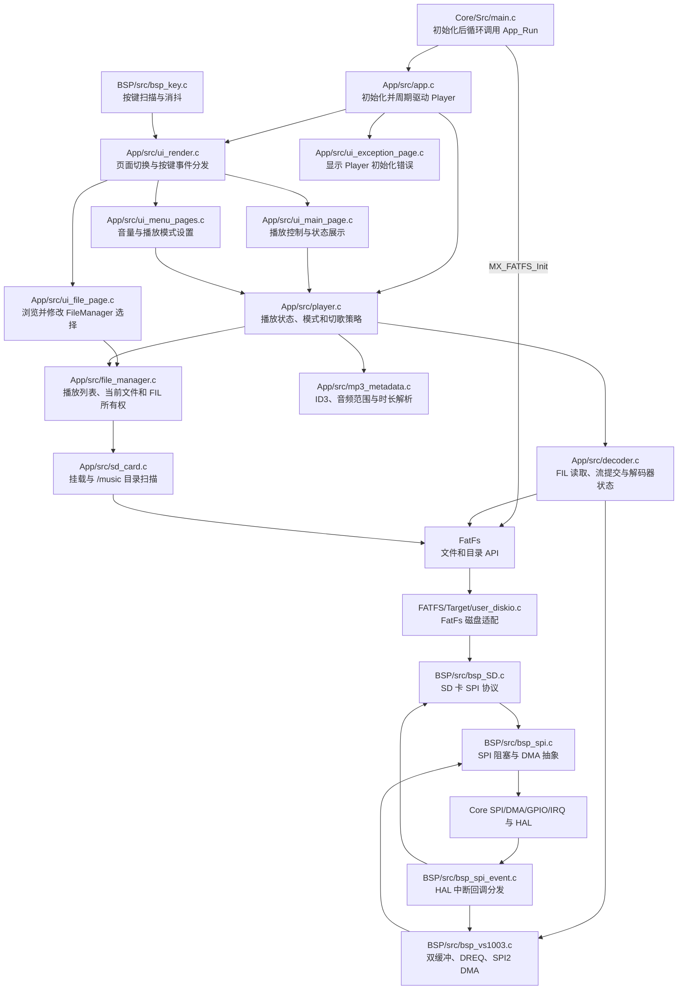
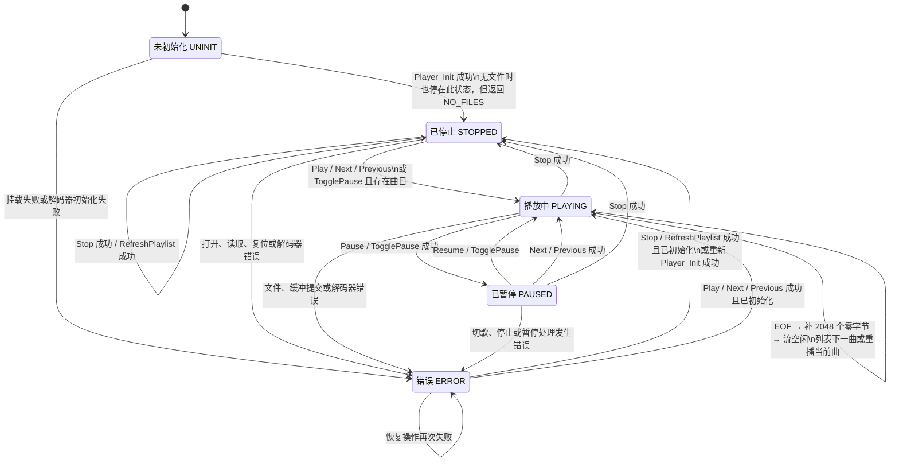

# Player 模块设计与调用关系

## 1. 文档范围

本文以当前源码为准，分析 `firmware/MiniAudioPlayerST/App/src/player.c` 的：

- 对外接口及其调用方；
- 直接依赖与播放链路上的间接依赖；
- VS1003 BSP 接口依赖；
- 一次播放过程中的数据流；
- Player 状态机及曲末处理。

当前固件采用裸机主循环：`main()` 持续调用 `App_Run()`。App 在运行态调用 `Player_Tick()`，并监测 Player 是否进入 `ERROR`；发生错误后立即进入异常页，每 1 秒重试一次 `Player_Init()`，成功后回到主页。`Player_Tick()` 调用 `Decoder_Tick()` 推进文件流，并处理播放完成或错误事件。Decoder 将 `FIL` 数据填入 VS1003 BSP 提供的两个 512 字节流缓冲区；BSP 负责 DREQ 流控、每次最多 32 字节的分块以及 SPI2 TX DMA。

SD 读写发生通信错误时，FatFs 磁盘适配层会停止当前 SD 事务并锁存 `STA_NOINIT`。后续挂载只有在重新执行 `BSP_SD_Init()` 成功后才会清除此状态，使运行中拔卡并重新插卡后能够进入完整的 SD 协议初始化流程。

## 2. 模块关系

### 2.1 相关模块职责

| 模块 | 与 Player 的关系 |
|---|---|
| `Core/Src/main.c` | 调用 `App_Init()`，随后在无限循环中调用 `App_Run()`，是 Player 周期运行的最上游入口。 |
| `App/src/app.c` | 生产环境中的生命周期协调者；在 `RUNNING/RECOVERING` 之间转换，把初始化或运行期错误交给异常页，并周期重试 `Player_Init()`。 |
| `App/src/ui_main_page.c` | 生产环境中的主要控制方和状态消费者；处理播放/暂停、上一曲、下一曲，并读取曲名、状态、模式、音量和时间。 |
| `App/src/ui_menu_pages.c` | 读取和设置 Player 音量、播放模式。 |
| `App/src/ui_render.c` | 每次 `App_Run()` 分发按键释放事件和页面 `on_tick`，从而间接触发主页面、菜单页面中的 Player 调用。 |
| `App/src/ui_file_page.c` | 不调用 Player，但与 Player 共用 FileManager；进入页面时重新扫描列表，L/R 键会改变 FileManager 的选中索引。 |
| `App/src/ui_exception_page.c` | 不调用 Player 函数，但依赖 `player_status_t`，将初始化或运行期错误映射为界面文字。 |
| `App/src/file_manager.c` | Player 的直接依赖；维护 `/music` 播放列表、当前选择、路径以及当前 `FIL` 的打开和关闭。 |
| `App/src/decoder.c` | Player 的直接依赖；借用 FileManager 的 `FIL *`，负责文件流读取、VS1003 控制、曲末排空和事件上报。 |
| `App/src/sd_card.c` | 经 FileManager 间接依赖；挂载 FatFs、扫描 MP3、按索引查找文件路径。 |
| `App/src/mp3_metadata.c` | Player 的直接依赖；读取 ID3v2/ID3v1、定位首个 MP3 帧，计算音频偏移、有效音频大小和时长。 |
| `FATFS/App/fatfs.c` | 由 `main.c` 在 App 初始化前调用 `MX_FATFS_Init()`，把 USER 磁盘驱动链接到 FatFs 并建立逻辑盘路径。 |
| `Middlewares/Third_Party/FatFs/src/ff.c` | FileManager 使用打开/关闭 API，Decoder 使用定位/读取 API，同时被 SD 卡用于目录遍历。 |
| `FATFS/Target/user_diskio.c` | FatFs 到 SD BSP 的适配层，将磁盘初始化、状态和扇区读取映射到 `BSP_SD_*`。 |
| `BSP/src/bsp_SD.c` | 播放文件读取链路上的间接 BSP 依赖；通过 SPI1 和 DMA 从 SD 卡读取 512 字节扇区。 |
| `BSP/src/bsp_vs1003.c` | Decoder 的直接 BSP 依赖；初始化/复位解码器，管理两个 512 字节缓冲区，按 DREQ 拆成不超过 32 字节的 SPI2 TX DMA。 |
| `BSP/src/bsp_spi_event.c` | 将 DREQ EXTI、SPI1/2 DMA 完成和错误回调分发到对应 BSP，是异步数据泵的反馈路径。 |
| `BSP/src/bsp_key.c` | 通过 TIM1 周期扫描产生按键释放事件，经 UI Render 和页面回调间接触发播放控制。 |
| `BSP/src/bsp_spi.c` | BSP SD 和 BSP VS1003 共用的 SPI/HAL 抽象。 |
| `Core/Src/spi.c`、`dma.c`、`gpio.c`、`stm32f0xx_it.c` | 提供 SPI1/SPI2、DMA 通道、DREQ GPIO/EXTI 和中断入口；Player 不直接调用。 |

测试目录中的 `app_test.c`、`playlist_test.c` 和 `main_page_test.c` 也直接调用 Player，用于集成测试和诊断，不属于正式运行链路。

## 3. Player 接口调用方

### 3.1 生产代码

| 调用模块 | 调用的 Player 接口 | 用途 |
|---|---|---|
| `App/src/app.c` | `Player_Init()`、`Player_Tick()`、`Player_GetState()`、`Player_GetLastError()` | 初始化 Player、推进播放，并在运行期检测错误后进入自动恢复。 |
| `App/src/ui_main_page.c` | `Player_TogglePause()`、`Player_Previous()`、`Player_Next()` | 响应 OK、L、R 按键。 |
| `App/src/ui_main_page.c` | `Player_GetCurrentPath()`、`Player_GetMode()`、`Player_GetState()`、`Player_GetCurrentIndex()`、`Player_GetElapsedSeconds()`、`Player_GetDurationSeconds()`、`Player_GetVolume()` | 刷新主界面的曲名、模式、状态、曲目索引、播放时间和音量。 |
| `App/src/ui_menu_pages.c` | `Player_GetVolume()`、`Player_SetVolume()` | 显示并按 10% 步进调整音量。 |
| `App/src/ui_menu_pages.c` | `Player_GetMode()`、`Player_SetMode()` | 进入模式页时读取当前模式，确认后写回。 |

### 3.2 测试代码

| 调用模块 | 调用的 Player 接口 |
|---|---|
| `App/test/src/app_test.c` | `Player_Init()`、`Player_Tick()`、`Player_GetState()`、`Player_GetLastError()`、`Player_GetTrackCount()` |
| `App/test/src/playlist_test.c` | `Player_Init()`、`Player_Play()`、`Player_Tick()`、`Player_TogglePause()`、`Player_Previous()`、`Player_Next()`、`Player_Stop()`、`Player_GetState()`、`Player_GetCurrentIndex()`、`Player_GetFilePosition()`、`Player_GetFileSize()`、`Player_GetProgressPercent()`、`Player_GetLastError()` |
| `App/test/src/main_page_test.c` | `Player_Init()`、`Player_Tick()`、`Player_GetCurrentPath()`、`Player_GetElapsedSeconds()`、`Player_GetDurationSeconds()`、`Player_GetTrackCount()`、`Player_GetCurrentIndex()`、`Player_GetState()`、`Player_GetMode()`、`Player_GetVolume()`、`Player_GetLastError()` |

### 3.3 当前没有外部调用方的公开接口

以下接口只在 `player.c` 内部使用，或目前完全没有调用方：

| 接口 | 当前情况 |
|---|---|
| `Player_RefreshPlaylist()` | 没有调用方。仅允许在非播放、非暂停状态重新挂载并扫描播放列表。 |
| `Player_PlaySelected()` | 没有调用方。封装“读取 FileManager 当前选择并播放”。 |
| `Player_Pause()`、`Player_Resume()` | 仅由 `Player_TogglePause()` 在 Player 内部调用。 |

`Player_Play()` 除测试代码外，也被 Player 内部的切歌、单曲循环和停止态恢复播放逻辑调用；`Player_Stop()` 当前只被 `playlist_test.c` 直接调用。

## 4. Player 的直接依赖接口

### 4.1 文件管理与元数据

| 依赖模块 | 接口 | 用途 |
|---|---|---|
| FileManager | `FileManager_Init()` | 挂载 SD 卡并扫描 `/music`。 |
| FileManager | `FileManager_Open()` / `FileManager_CloseCurrent()` | 打开、关闭并持有当前 `FIL`。 |
| FileManager | `FileManager_GetFileCount()` / `FileManager_GetSelectedIndex()` | 取得曲目数和列表选中项。 |
| FileManager | `FileManager_GetCurrentIndex()` / `FileManager_GetCurrentPath()` | 向 Player 提供当前播放曲目信息。 |
| FileManager | `FileManager_GetAdjacentIndex()` | 封装上一曲/下一曲的列表边界环绕计算。 |
| Decoder | `Decoder_Init()` / `Decoder_Start()` / `Decoder_Stop()` | 初始化解码器并管理单曲流生命周期。 |
| Decoder | `Decoder_Tick()` | 推进 `FIL` 读取与双缓冲提交，返回完成或错误事件。 |
| Decoder | `Decoder_Pause()` / `Decoder_Resume()` / `Decoder_SetVolume()` | 执行解码器播放控制。 |
| Decoder | `Decoder_GetTransferredBytes()` / `Decoder_GetElapsedSeconds()` | 向 Player 提供进度和解码时间。 |
| MP3 Metadata | `MP3_MetadataRead()` | 解析音频起点、有效音频长度和总时长。 |
| FatFs | 无 Player 直接调用 | FileManager 持有 `FIL`，Decoder 负责定位和流式读取。 |

### 4.2 Decoder 调用的 VS1003 BSP 接口

| BSP 接口 | Decoder 中的用途 |
|---|---|
| `BSP_VS1003_Init()` | `Decoder_Init()` 中初始化并校验解码器。 |
| `BSP_VS1003_SoftReset()` | 开始新曲和停止播放时清理旧流并重新配置解码器。 |
| `BSP_VS1003_AbortStream()` | 重置当前曲目、错误处理或切歌时立即停止 DMA 并清空双缓冲。 |
| `BSP_VS1003_GetState()` | 填充数据或曲末补零前确认 BSP 仍处于 `READY`。 |
| `BSP_VS1003_GetWriteBuffer()` | 从 BSP 双缓冲中申请一个空闲的 512 字节生产缓冲区。 |
| `BSP_VS1003_CommitBuffer()` | 提交实际读取字节数，缓冲区由 `WRITING` 变为 `READY` 并尝试启动发送。 |
| `BSP_VS1003_CancelWriteBuffer()` | 文件读取失败、EOF 或提交失败时释放尚未提交的写缓冲。 |
| `BSP_VS1003_IsStreamIdle()` | 曲末补零完成后等待所有已提交数据和 DMA 均发送完毕。 |
| `BSP_VS1003_PauseStream()` | 暂停播放；也用于修改 SCI 音量寄存器或读取解码时间前等待当前 DMA 完成。 |
| `BSP_VS1003_ResumeStream()` | 恢复异步数据发送。 |
| `BSP_VS1003_SetVolume()` | 写左右声道衰减值；Decoder 将 0%~100% 映射为 `0xFE` 或 80~0 的衰减值。 |
| `BSP_VS1003_ReadRegister()` | 读取 `SCI_DECODE_TIME`，更新已播放秒数。 |
| `BSP_VS1003_GetStreamTransferredBytes()` | 获取 SPI2 DMA 已完成发送的音频字节数，用于进度百分比。 |

Player 不再直接包含 `bsp_vs1003.h`。Decoder 检查 `BSP_VS1003_STATE_READY`、`BSP_VS1003_OK` 和 `BSP_VS1003_REG_DECODE_TIME`，并把错误转换为 Decoder 事件或状态码。

### 4.3 播放链路上的间接 BSP 接口

Player 不直接调用 SD BSP 或通用 SPI BSP，但文件读取会经过以下接口：

| 层级 | 播放链路实际使用或可触发的接口 |
|---|---|
| FatFs 磁盘适配 | `USER_initialize()`、`USER_status()`、`USER_read()`、挂载阶段可能调用 `USER_ioctl()` |
| SD BSP | `BSP_SD_Init()`、`BSP_SD_GetState()`、`BSP_SD_ReadBlocks()`，磁盘信息查询时使用 `BSP_SD_GetInfo()` |
| SD 侧通用 SPI | `BSP_SPI_RW()`、`BSP_SPI_Tx()`、`BSP_SPI_Rx()`、`BSP_SPI_SetPrescaler()`、`BSP_SPI_TxRx_DMA()`、`BSP_SPI_DMAStop()` |
| VS1003 侧通用 SPI | `BSP_SPI_TxRx()`、`BSP_SPI_SetPrescaler()`、`BSP_SPI_Tx_DMA()`、`BSP_SPI_DMAStop()` |

`USER_write()`、`BSP_SD_WriteBlocks()` 和 `BSP_SD_Sync()` 虽然存在于磁盘适配层，但播放链路是只读的，不会由 Player 主动触发。

## 5. 一次播放链路的数据流向

```mermaid
flowchart LR
    SD[("microSD<br/>MP3 文件")]
    SPI1["SPI1 + DMA1 CH2/CH3<br/>512 B 扇区读取"]
    BSP_SD["BSP_SD_ReadBlocks"]
    DISKIO["USER_read"]
    FATFS["FatFs<br/>f_open / f_lseek / f_read"]
    META["MP3_MetadataRead<br/>音频偏移、长度、时长"]
    PLAYER_TICK["Player_Tick<br/>事件协调"]
    DECODER_TICK["Decoder_Tick<br/>裸机主循环生产者"]
    BUF["VS1003 双缓冲<br/>2 × 512 B<br/>EMPTY → WRITING → READY → ACTIVE"]
    CHUNK["BSP VS1003<br/>每次最多切出 32 B"]
    SPI2["SPI2 TX DMA<br/>DMA1 CH5"]
    VS[("VS1003<br/>SDI FIFO 与硬件解码")]
    AUDIO[("DAC / AUX<br/>模拟音频")]

    SD -->|"扇区字节"| SPI1
    SPI1 --> BSP_SD
    BSP_SD --> DISKIO
    DISKIO --> FATFS
    FATFS -->|"首次播放前读取"| META
    META -->|"audio_offset / audio_size"| DECODER_TICK
    PLAYER_TICK --> DECODER_TICK
    DECODER_TICK -.->|"FINISHED / ERROR"| PLAYER_TICK
    FATFS -->|"f_read 直接写入申请到的缓冲"| BUF
    DECODER_TICK -->|"GetWriteBuffer + CommitBuffer"| BUF
    BUF --> CHUNK
    CHUNK --> SPI2
    SPI2 -->|"XDCS 有效时发送 MP3 原始字节"| VS
    VS --> AUDIO

    DREQ["DREQ 上升沿或高电平"] -.-> EVENT["EXTI 回调<br/>BSP_VS1003_DREQCallback"]
    EVENT -.-> CHUNK
    SPI2 -.->|"DMA 完成回调"| DONE["BSP_VS1003_SPI_TxCpltCallback<br/>累计 transferred_bytes<br/>推进或释放缓冲"]
    DONE -.-> CHUNK
```

### 5.1 数据流步骤

1. `Player_Play(track_index)` 要求 FileManager 打开 `/music` 下指定 MP3，FileManager 持有 `FIL` 并把借用指针返回给 Player。
2. `MP3_MetadataRead()` 使用 Player 内部的 512 字节 `metadata_buffer` 读取 ID3 和 MP3 帧头，得到 `audio_offset`、`audio_size`、`duration_seconds`。
3. `Decoder_Start()` 将 `FIL` 定位到音频起点，软件复位 VS1003 并重新应用当前音量；Player 随后切换为 `PLAYING`。
4. 主循环中的 `Player_Tick()` 调用 `Decoder_Tick()`。Decoder 向 BSP 申请一个空闲的 512 字节缓冲区，再用 `f_read()` 直接写入该缓冲区。
5. `BSP_VS1003_CommitBuffer()` 把缓冲区标为 `READY`。若 DREQ 为高且没有 DMA 正忙，BSP 立即将其标为 `ACTIVE`，从中取最多 32 字节启动 SPI2 TX DMA。
6. DMA 完成中断经 `bsp_spi_event.c` 进入 `BSP_VS1003_SPI_TxCpltCallback()`，推进当前缓冲偏移并累计 `transferred_bytes`。当前 512 字节缓冲发送完后回到 `EMPTY`，BSP 再尝试发送另一个 `READY` 缓冲。
7. VS1003 的 DREQ 上升沿也经 `bsp_spi_event.c` 调用 `BSP_VS1003_DREQCallback()`，用于在解码器可继续接收时启动下一段最多 32 字节的数据。
8. Decoder 根据 `audio_size` 限制最后一次读取。有效音频耗尽或 `f_read()` 返回 0 后进入 `DRAINING`，通过同一双缓冲链路提交 2048 个零字节。
9. 补零数量归零且 `BSP_VS1003_IsStreamIdle()` 为真后，Decoder 返回 `FINISHED`。Player 再关闭旧文件，列表循环调用 `Player_Next()`，单曲循环重新调用 `Player_Play(current_index)`。

Decoder 的 `submitted_bytes` 是已从文件读取并成功提交的字节数；`BSP_VS1003_GetStreamTransferredBytes()` 是 DMA 已实际发送给 VS1003 的字节数。公开的 `Player_GetFilePosition()` 通过 Decoder 使用后者，因此不会把仍在双缓冲中排队的数据计为已播放进度。

## 6. Player 状态机

### 6.1 状态转换说明

| 当前状态 | 事件或接口 | 目标状态 | 关键动作 |
|---|---|---|---|
| `UNINIT` | `Player_Init()` 完成挂载、扫描和 VS1003 初始化 | `STOPPED` | 设置默认列表循环和 70% 音量；如果没有 MP3，状态仍为 `STOPPED`，但返回 `PLAYER_ERR_NO_FILES`。 |
| `UNINIT` | 挂载或解码器初始化失败 | `ERROR` | `Player_SetError()` 清流、关文件并记录错误。 |
| `STOPPED` | `Player_Play()` 或停止态 `Player_TogglePause()` | `PLAYING` | 清旧流、打开文件、解析元数据、定位音频起点、软复位解码器并应用音量。 |
| `PLAYING` | `Player_Pause()` | `PAUSED` | 禁止启动新 DMA，等待当前 DMA 完成。 |
| `PAUSED` | `Player_Resume()` | `PLAYING` | 恢复异步发送并立即尝试消费已提交缓冲。 |
| `PLAYING` / `PAUSED` | `Player_Stop()` | `STOPPED` | 中止 DMA、释放双缓冲、关闭文件并软件复位解码器。 |
| `PLAYING` / `PAUSED` / `STOPPED` | `Player_Next()`、`Player_Previous()` | `PLAYING` | 手动操作始终选择相邻索引，不受 PlayMode 影响。 |
| `PLAYING` | 有效音频结束 | 保持 `PLAYING` | Decoder 进入 `DRAINING`并提交 2048 个零字节；返回 `FINISHED` 后 Player 按 PlayMode 下一曲或重播。 |
| 任意已初始化状态 | 文件或 VS1003 关键操作失败 | `ERROR` | 中止流、关闭文件、清曲目信息并保存 `last_error`。 |

补充边界：

- `Player_SetMode()`、各 Getter 以及成功的 `Player_SetVolume()` 不改变播放状态。
- `Player_SetVolume()` 失败只更新 `last_error`，不会立即进入 `ERROR`。
- `Player_GetElapsedSeconds()` 委托 Decoder 暂停流后读取 `SCI_DECODE_TIME`；读取或暂停失败时保留最近一次有效值。
- `Player_RefreshPlaylist()` 在 `PLAYING` 或 `PAUSED` 状态返回 `PLAYER_ERR_PARAM`；初始化阶段失败导致 `initialized=0` 时也不能用它恢复，必须重新调用 `Player_Init()`。
- `Player_Resume()` 只在 `Decoder_Resume()` 成功后才把 Player 状态改为 `PLAYING`。

## 7. 关键实现约束

- Player、Decoder 和 FileManager 均为单例，使用各自源文件内的静态上下文。
- 当前实现假定主循环串行调用；FileManager 和 SD 卡目录扫描也使用静态缓冲，不支持并发扫描。
- Decoder 每次最多生产一个 512 字节缓冲，VS1003 的单次 SDI 发送上限为 32 字节，两者不能混淆。
- 文件流只提交去除 ID3v2/ID3v1 后的有效 MP3 数据；元数据无法确认音频大小时，才依靠 `f_read()` 返回 0 判断 EOF。
- 切歌、停止和错误路径都必须先调用 `Decoder_Abort()` 或 `Decoder_Stop()`，再调用 `FileManager_CloseCurrent()`，防止 Decoder 持有失效的 `FIL *`。
